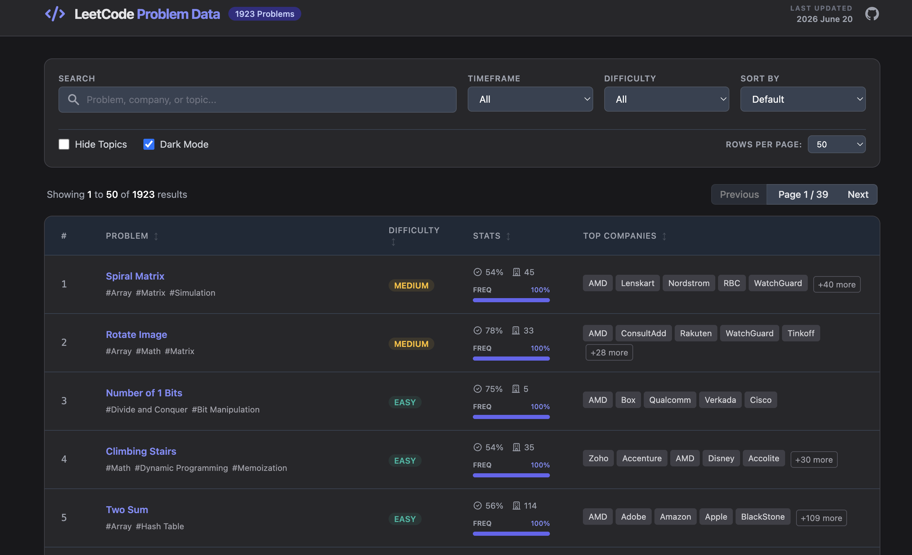

# LeetCode Company Tags Viewer

A modern, portable, single-page application to browse LeetCode problems by company frequency and tags.

## 🚀 How to Use
This project is designed for maximum portability. You do not need to install anything or set up a server.
1.  **Download** the `leetcode.html` file from this repository.
2.  **Open** the file directly in any modern web browser (Chrome, Firefox, Safari, Edge).
3.  **Search & Filter** instantly. It works entirely offline!

## ✨ Key Benefits
-   **Single-File Portability:** All data and logic are embedded in a single `leetcode.html` file (~2MB).
-   **Blazing Fast Search:** Features multi-token "AND" logic (e.g., `AMD, #Array`) and fuzzy search for problem titles.
-   **Full Context:** View company frequencies across different timeframes (30 days, 6 months, etc.).
-   **Modern UI:** Clean, responsive interface with a built-in Dark Mode.
-   **Offline Ready:** Once downloaded, you can check frequencies without an internet connection.

## 🛠️ Features
-   **Fuzzy Search:** Quick-match problem titles (e.g., searching "lcs" finds "Longest Common Subsequence").
-   **Smart Autocomplete:** Suggested companies and topics with strict topic filtering using the `#` prefix.
-   **Timeframe Selection:** Recalculates frequency and sorting dynamically.
-   **Dark Mode:** Comfortable viewing for long study sessions.

## 🙏 Credits
-   **Original Data Source:** [liquidslr/leetcode-company-wise-problems](https://github.com/liquidslr/leetcode-company-wise-problems)
-   **Project Creator:** [bryanofphy](https://github.com/bryanofphy/leetcode-company-tags-frequency)

---
*Disclaimer: This tool is for educational purposes to help with interview preparation.*
